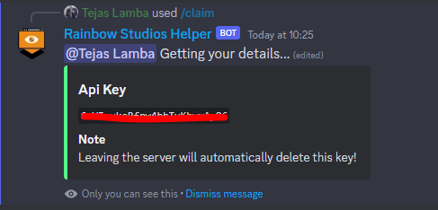
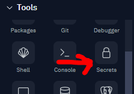
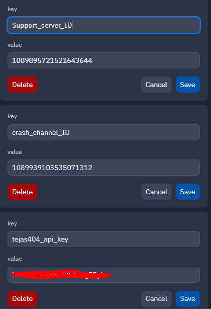

# Chatopia | Open source free chatbot

> Making connections happen

## What is chatopia?

> Chatopia is a Discord bot that conducts a conversation with a human end user. This type of technology is designed to simulate a conversation with a human visitor. It becomes smatter the more you talk it! As bots become smarter and more sophisticated, the more organized their conversations become!

## What API does it use?

> Chatopia usses [Tejas404 API](https://api.tejas404.xyz/ "Visit their site") to get the functionality of the chatbot. The `ChatGPT` Function is API Key only so you may require it.

#### How to get the API Key?

> It's simple just join their discord server by clicking [here](https://api.tejas404.xyz/discord "Rainbow Studios"). Then go in `#🤖︱bot-commands` and run `/claim` to get your api key.
> 

**Note: Leaving the server will delete your api key**

## Can I use the source code of the bot?

> Sure you can! But keep in mind not to remove credits and don't argue that you made it

#### For People making a youtube video on it

> There should be a line in your video description

```
Credits to visa2code - https://youtube.com/@visa2code
His discord server - https://discord.gg/nP2fB7M4Xf
```

> Any video not following this will be taken down!

## Setup Chatopia

- Step 1 <br>
  Create a `.env` file with this template

```
tejas404_api_key=
openai_key=
Support_server_ID=
crash_channel_ID=
```

Fore replit users head over to the Secrets tab

And add these values


- Step 2 <br>
  Fill or create a `config.json` file with this template

```json
{
  "token": "", //You Bot token
  "DataBaseURL": "", //MongoDB URL
  "OwnerId": "" //Your ID
}
```

Tip: [How to get a mongodb URL?](https://www.youtube.com/watch?v=RQMWKRlMtH0 "YouTube Video") <br>
Do remove these comments or else it will give error(`//`)

- Step 3 <br>
  Now te final step. Run `npm install` and it will install all necessary packages. At last run `npm run start` or `node .`
  <br>
  **And your bot should be up and running!**
# For Emojis [Click here]P)(https://api.tejas404.xyz/discord "Rainbow Studios")

## Problems? or cant host it?

Well I also run a public version of chatopia. You can invite it by clicking [here](https://api.tejas404.xyz/chatopia_invite "Invite Chatopia!"). Anyways you can ask help in my support server by clicking [here](https://api.tejas404.xyz/discord "Rainbow Studios")

## Contributing

Steps to contribute:


That's it Thanks for contributing!

# License

[DBAD License](https://github.com/The-Rainbow-Studios/Chatopia/blob/main/LICENSE.md)

# Support

For support join our [discord support server](https://api.tejas404.xyz/discord).

# Authors

- [@TajuModding](https://github.com/TajuModding)
